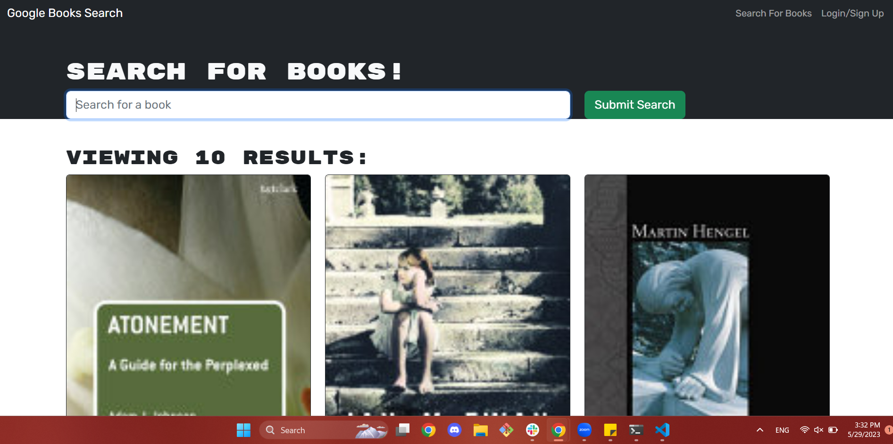

# Book Search Engine []

  ## Description

  The Book Search Engine is a program designed for readers of various intensities to find a book to read and save it to a "read later" list. Upon searching for a book, a user can see multiple editions and their corresponding synopsis that is provided on Google Books. After searching for a book, a user should be presented with a screen similar to this: 

  After targeting the desired book or edition, if a user is logged in, a user is then able to save it to their list. If a user is not logged in or signed up, a user will be redirected to that form to be able to access saving and deleting books from their saved list. Directing to the Saved books page, a user should be presented with a similar screen: 
  
  This application has been repurposed from a RESTful API to GaqphQL and uses the Google Books API. 

  ---
  ## Table of Contents 

  - [Installation](#instlalation)
  - [Usage](#usage)
  - [License](#license) 
  - [Contributing](#contributing)
  - [Tests](#tests)
  ---

  ## Installation

  For commercial use, simply direct to the [deployed link](https://still-brushlands-58913.herokuapp.com/) and use as normal. 

  For developer use, one should clone this repo and install all dependencies, minding all of `package.json`s in the client, server, and root directories. 

  ## Usage 

  As a user, this application functions not too differently than Google Books itself, in that there are no special usage instructions. 

  ## License
  
  [License: MIT](https://opensource.org/licenses/MIT)
  
  Copyright 2023 Anna Langford
  
  Permission is hereby granted, free of charge, to any person obtaining a copy of this software and associated documentation files (the "Software"), to deal in the Software without restriction, including without limitation the rights to use, copy, modify, merge, publish, distribute, sublicense, and/or sell copies of the Software, and to permit persons to whom the Software is furnished to do so, subject to the following conditions:
  
  The above copyright notice and this permission notice shall be included in all copies or substantial portions of the Software.
  
  THE SOFTWARE IS PROVIDED "AS IS", WITHOUT WARRANTY OF ANY KIND, EXPRESS OR IMPLIED, INCLUDING BUT NOT LIMITED TO THE WARRANTIES OF MERCHANTABILITY, FITNESS FOR A PARTICULAR PURPOSE AND NONINFRINGEMENT. IN NO EVENT SHALL THE AUTHORS OR COPYRIGHT HOLDERS BE LIABLE FOR ANY CLAIM, DAMAGES OR OTHER LIABILITY, WHETHER IN AN ACTION OF CONTRACT, TORT OR OTHERWISE, ARISING FROM, OUT OF OR IN CONNECTION WITH THE SOFTWARE OR THE USE OR OTHER DEALINGS IN THE SOFTWARE.

  ## Contributing

  No other developers contributed to this application. 

  ## Tests

  This application has no tests.
